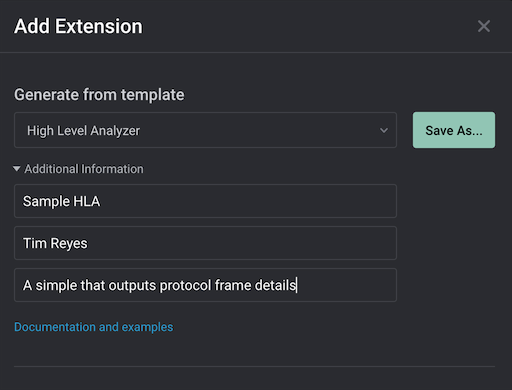
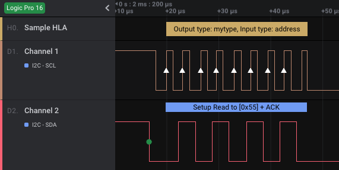

# How to Create an Extension?

## Create an Extension

In this guide, we will walk your through creating an HLA \(High Level Analyzer\) extension, however, the process is identical for other types.  

1. Click the 'Extensions' panel button on the right of the software

2. Click 'Create Extension'  
3. Under 'Generate from template', choose the type of extension you would like to create. For this example, we will create a High Level Analyzer.  
4. _**\(Optional\)**_ Click 'Additional Information' to fill in information about your extension.

5. Click 'Save As...' to save and select your location.  
6. You should now see your new extension listed as 'Local' in the software.

## Use your High Level Analyzer

1. To test the new Sample HLA, capture any protocol data for [one of the supported analyzers](analyzer-frame-types/), and add the appropriate protocol analyzer. We've provided an I2C capture below in case you don't have a protocol data recording available.



2. Click the Analyzers '+' button to add our Sample HLA. 

3. In the settings popup, select 'I2C' under Input Analyzer. For the rest of the settings, you can leave them as default and click 'Finish'. Once you add the HLA, you can see it as a virtual channel as shown in the image below.

### Customize your High Level Analyzer

To edit the Sample HLA \(perhaps as a starting point to creating your own HLA\), you can click the 'Local' button next to 'Sample HLA' under the Extensions panel. This will open the containing folder for your extension files which you can update for your needs. 

Check out our [High Level Analyzer](high-level-analyzer-quickstart.md) article to learn more about customizing your HLA.

## Use your Measurement

The software currently has a few built-in measurements already installed and ready to use. The gif below demonstrates how to use them. You can also hold the shift key while dragging across your recorded data to add a measurement without using the sidebar. The use of measurement extensions allows additional custom measurements to be made. 

To see your new measurement in action, take a capture of digital data and add a measurement to it as shown above. You should see the new measurements:

###  Customize your Measurement 

‌To edit the Sample Measurement, you can click the 'Local' button next to 'Sample Measurement' under the Extensions panel. This will open the containing folder for your extension files which you can update for your needs.‌

Check out our [Measurement](measurement-extensions.md) article to learn more about customizing your Measurement.

