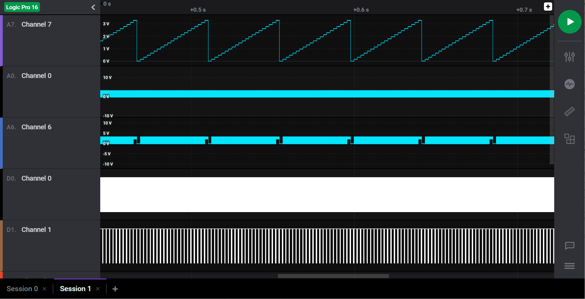

# Measurement Extensions

The software currently has a few built-in measurements already installed and ready to use. The gif below demonstrates how to use them. You can also hold the shift key while dragging across your recorded data to add a measurement without using the sidebar. The use of measurement extensions will allow additional custom measurements to be made. 



### Getting Started with Measurement Extensions

A measurement extension consists of at least two files, all of which should be stored in the same folder.

* an `extension.json` file, which stores information about the extension
* one or more python source files

To quickly get acquainted with measurement extensions, you can follow along with our example project below. Here, we will walk you through the installation of a custom measurement extension which you can try out immediately.

1. Make sure you're running the latest version of [Logic 2.x software](https://ideas.saleae.com/f/changelog/).  
2. Download our [Extensions Examples](https://github.com/saleae/logic2-extensions-examples). You can place this anywhere you like, such as your Desktop.  
3. Open the Logic 2.x software. Click the 'Extensions button' to open the 'Extensions Panel' and click 'Create Extension.'


4. A pop-up window will appear. Under 'Load existing extension', click 'select .json file'  
5. Navigate to your previously downloaded Extensions Examples folder. In this guide, we will install a Pulse Count digital measurement. Navigate to pulseCount and select its `extension.json` file.  
6. You should now see 'Pulse Count' appear in the 'Extensions' panel of the software.


7. To see your new measurement in action, take a capture of digital data and add a measurement to it as shown in the gif at the top of this article. You should see the new measurements:


* Np\(+\) for number of positive pulses
* Np\(-\) for number of negative pulses

### Extension File Layout \(extension.json\)

Let's take a look at the `extension.json` file for our Pulse Count extension that we recently installed above. There exists some key metadata properties to note below.

```text
"author": "Tim Reyes",
"description": "Count pos and neg pulses",
"name": "Pulse Count",
```

The `author`, `description`, and `name` properties manage what appears in the Extensions panel where the extensions are managed. 

```text
"extensions": {
  "Pulses": {
    "type": "DigitalMeasurement",
    "entryPoint": "pulseCount.PosNegPulseMeasurer",
    "metrics": {
      "positivePulses": {
        "name": "Positive Pulses",
        "notation": "N<sub>p(+)</sub>"
      },
      "negativePulses": {
        "name": "Negative Pulses",
        "notation": "N<sub>p(-)</sub>"
      }
    }
  }
}
```

The `extensions`  section describes more properties specific to your extension. Note that multiple measurements can exist within a single extension. In this example, we include only one called `Pulses`. Below are the properties for `Pulses`.

* `type` - here we tell the software that this will be a `DigitalMeasurement`. On the other hand, an analog measurement will have the type `AnalogMeasurement`
* `entryPoint` - points the software to the measurement's python file and its class name. This line is structured like so: `<python_file_name>.<python_class_name>`
* `metrics` - describes how the software will display the metrics for the measurement. Also, take note of the strings you give for the metrics. In this example, we use the strings `"positivePulses"` and `"negativePulses"`. Later in our python file, we will refer to these strings when we pass our metric values to the software.

### Python File Layout

Digital measurements are implemented with a class that looks like this. Take a look at `pulseCount.py` to see how this was implemented for our Pulse Count extension.

```text
from saleae.range_measurements import DigitalMeasurer

class MyDigitalMeasurement(DigitalMeasurer):
  # Add supported_measurements here. This includes the metric
  # strings that were defined in the extension.json file.

  def __init__(self, requested_measurements):
    super().__init__(requested_measurements)
    # Initialize your variables here

  def process_data(self, data):
    for t, bitstate in data:
    # Process data here
  
  def measure(self):
    values = {}
    # Assign the final metric results here to the values object
    return values
```


